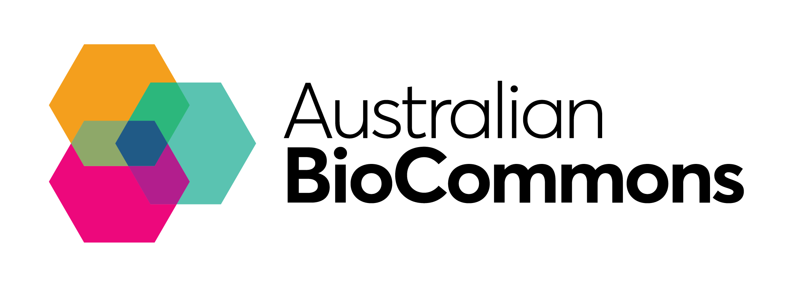

  
    
  
  <!--  -->

  

<!--  -->

## Introduction to Machine Learning in R - from data to knowledge

With the rise in high-throughput sequencing technologies, the volume of omics data has grown exponentially. A major issue is to mine useful knowledge from these heterogeneous collections of data. The analysis of complex high-volume data is not trivial and classical tools cannot be used to explore their full potential. Machine Learning (ML), a discipline in which computers perform automated learning without being programmed explicitly and assist humans to make sense of large and complex data sets, can thus be very useful in mining large omics datasets to uncover new insights that can advance the field of bioinformatics.

This hands-on workshop will introduce participants to the ML taxonomy and the applications of common ML algorithms to health data. The workshop will cover the foundational concepts and common methods being used to analyse omics data sets by providing a practical context through the use of basic but widely used R libraries. Participants will acquire an understanding of the standard ML processes, as well as the practical skills in applying them on familiar problems and publicly available real-world data sets.

### Learning outcomes

By the end of the workshop you should be able to:

- Understand key ML concepts, common algorithms and terminology
- Understand the importance of ML in analysing complex, high-volume health-related data
- Use R packages to implement an ML workflow on real-world dataset, from data preparation to model application and evaluation

### Lead Trainer

Dr **Fotis Psomopoulos**, *Senior Researcher* 

Institute of Applied Biosciences (INAB) 
Center for Research and Technology, Hellas (CERTH)

### Workshop Format

The workshop will be run as a series of code-along sessions, with some additional activities for participants to complete throughout the sessions. All participants will stay in the main room, unless they are experiencing technical difficulties and require 1:1 support from a trainer. 

**Date/Time**: Monday 9 December 2024, 
*1 - 5 pm AEDT / 12 - 4 pm AEST / 12:30 - 4:30 pm ACDT / 10 am - 2 pm AWST*

**Location**: Online

### Who the workshop is for

This workshop is for Australian researchers who are or will apply ML to the analysis of omics data as part of their projects. It is suitable for beginners in ML. You must be associated with an Australian organisation for your application to be considered.

### Prerequisites

No previous knowledge of ML is required or expected (please note, that this will be an introductory course to ML)
Familiarity with the R programming language. If you need a refresher on R/RStudio try the Introduction to R and RStudio section of this online tutorial

### How to apply

This workshop is free but participation is subject to application with selection. 

**Applications close at 11:59pm AEST, 24 November 2024.**

Applications are reviewed by the organising committee and all applicants will be informed of the status of their application (successful, waiting list, unsuccessful). Successful applicants will be provided with a Zoom meeting link closer to the date. More information on the selection process is provided in our Advice on applying for Australian BioCommons workshops.

[**Apply here**](https://www.eventbrite.com.au/e/workshop-introduction-to-machine-learning-in-r-from-data-to-knowledge-tickets-1066494576989).

### Schedule

*Note: this schedule is fairly tentative and will adapt to the trainees needs and questions, with the expection of* _**start, stop, and break time which will be scrupulously respected.**_

|  Time  |  Details |
|--------|----------|
| 13:00 - 13:10 | **Course Introduction**.     - Welcome.   - Introduction and CoC.   - Way to interact   - Practicalities (agenda, breaks, etc).  - Setup   [_Link to material_](episodes/setup.md) |
| 13:10 - 13:20 | **Introduction to Machine Learning** (_theory_) [_Link to material_](episodes/01-intro.md) [_Link to material_](episodes/02-bioinformatics-and-ml.md)|
| 13:20 - 14:20 | **What is Exploratory Data Analysis (EDA) and why is it useful?** (_hands-on_)    - Loading omics data   - PCA   [_Link to material_](episodes/03-eda.md) |
| 14:20 - 14:30 |  **Introduction to Unsupervised Learning** (_theory_) |
| 14:30 - 15:30 |  **Agglomerative Clustering: k-means** (_practical_) [_Link to material_](episodes/04-unsupervised-learning.md) |
| 15:30 - 15:40 |  **Introduction to Supervised Learning** (_theory_) |
| 15:40 - 16:40 |  **Building a classifier: decision trees** (_practical_) [_Link to material_](episodes/05-supervised-learning-classification.md) |
| 16:40 - 17:00 |  _Wrap-up and closing of workshop |

<!-- 
| 10:00 - 10:30 | **Introduction to Machine Learning** (_theory_) |
| 10:30 - 11:00 | 
| 11:00 - 11:30 | _Coffee Break_ |
| 11:30 - 12:30 | **Exploratory Data Analysis - continued** (_hands-on_) |
| 12:30 - 14:00 | _Lunch break_ |
| 14:00 - 14:30 | **Introduction to Unsupervised Learning** (_theory_) |
| 14:30 - 15:00 | **Agglomerative Clustering: k-means** (_practical_) [_Link to material_](episodes/04-unsupervised-learning.md) |
| 15:00 - 15:30 | _Coffee Break_ |
| 15:30 - 18:30 | **Agglomerative Clustering: k-means - continued** (_practical_) |
| 18:30         | _Closing of Day 1_ |

| Presenter |  Activity | Start | Duration (min) |
|---------  |---------- | ----- | -------------- |
|           | Slack Q&A |       | Whole Workshop |
| Melissa | **Workshop Day 1 welcome and housekeeping**   - Introduction to workshop | 1:00 AEDT | 10 | -->

## Other examples

If you finish all the exercises and wish to practice on more examples, here are a couple of good examples to help you get more familiar with the different ML techniques and packages.
1. [RNASeq Analysis in R](https://combine-australia.github.io/RNAseq-R/06-rnaseq-day1.html)
2. [Use the Iris R built-in data set](https://github.com/fpsom/CODATA-RDA-Advanced-Bioinformatics-2019/blob/master/3.Day3.md) to run clustering and also some supervised classification and compare results obtained by different methods.

## Sources / References

The material in the workshop has been based on the following resources:

1. [ELIXIR CODATA Advanced Bioinformatics Workshop](https://codata-rda-advanced-bioinformatics-2019.readthedocs.io)
2. [Machine Learning in R](https://hugobowne.github.io/machine-learning-r/), by [Hugo Bowne-Anderson](https://twitter.com/hugobowne) and [Jorge Perez de Acha Chavez](https://twitter.com/jorge_pda)
3. [Practical Machine Learning in R](https://leanpub.com/practical-machine-learning-r), by [Kyriakos Chatzidimitriou](https://leanpub.com/u/kyrcha), [Themistoklis Diamantopoulos](https://leanpub.com/u/thdiaman), [Michail Papamichail](https://leanpub.com/u/mpapamic), and [Andreas Symeonidis](https://leanpub.com/u/symeonid).
4. [Linear models in R](https://monashbioinformaticsplatform.github.io/r-linear/topics/linear_models.html), by the [Monash Bioinformatics Platform](https://www.monash.edu/researchinfrastructure/bioinformatics)
5. Relevant blog posts from the [R-Bloggers](https://www.r-bloggers.com/) website.
6. [Predicting the breast cancer by characteristics of the cell nuclei present in the image](https://rstudio-pubs-static.s3.amazonaws.com/411600_3185f5d17d104cc5beb4587094b905e9.html#comparison-with-scientific-paper)

Relevant literature includes:

1. [Pattern Recognition and Machine Learning](http://users.isr.ist.utl.pt/~wurmd/Livros/school/Bishop%20-%20Pattern%20Recognition%20And%20Machine%20Learning%20-%20Springer%20%202006.pdf) by Christopher M. Bishop.
2. [Machine learning in bioinformatics](https://academic.oup.com/bib/article/7/1/86/264025), by Pedro Larrañaga et al.
3. [Ten quick tips for machine learning in computational biology](https://biodatamining.biomedcentral.com/articles/10.1186/s13040-017-0155-3), by Davide Chicco
3. [Statistics versus machine learning](https://www.nature.com/articles/nmeth.4642)
4. [Machine learning and systems genomics approaches for multi-omics data](https://biomarkerres.biomedcentral.com/articles/10.1186/s40364-017-0082-y)
5. [A review on machine learning principles for multi-view biological data integration](https://academic.oup.com/bib/article/19/2/325/2664338)
6. [Generalized Linear Model](https://www.sciencedirect.com/topics/mathematics/generalized-linear-model)

<!-- ## Additional information

**Coordination**: Pedro L. Fernandes, Training Coordinator of [ELIXIR-PT](https://biodata.pt/), [Instituto Gulbenkian de Ciência](https://igc.gulbenkian.pt/)

ELIXIR-PT abides by the [ELIXIR Code of Conduct](https://elixir-europe.org/events/code-of-conduct). Participants in this course are also required to abide by the same code. -->

## License

This material is made available under the [Creative Commons Attribution 4.0 International license](https://creativecommons.org/licenses/by/4.0). Please see [LICENSE](LICENSE.md) for more details.

## Citation

Wandrille Duchemin, Crhistian Cardona, Pedro L. Fernandes, & Fotis E. Psomopoulos. (2021). Introduction to Machine Learning (v1.0.0). Zenodo. https://doi.org/10.5281/zenodo.5752486

Additionnaly, we would like to acknowledge that this training materials draws heavily from :

Shakuntala Baichoo, Wandrille Duchemin, Geert van Geest, Thuong Van Du Tran, Fotis E. Psomopoulos, & Monique Zahn. (2020, July 23). Introduction to Machine Learning (Version v1.0.0). Zenodo. http://doi.org/10.5281/zenodo.3958880
